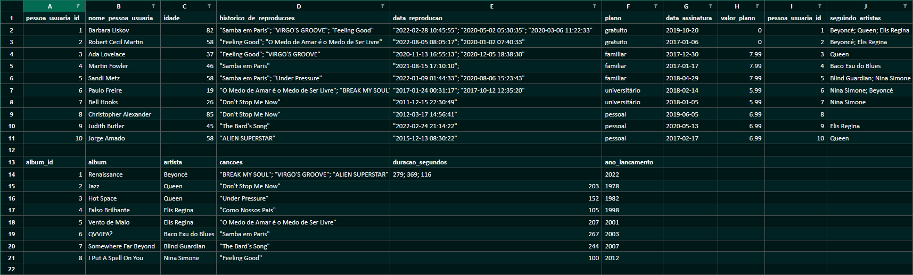

# One For All 🚀

####  Normalization and population of worksheets in a database so that you can run queries in order to find the requested information.

<details>
<summary> 🐳 Getting started with Docker Compose</summary><br>

```bash
docker-compose up -d
docker exec -it one_for_all bash
npm test 
```

</details>

<details>
<summary>🐳 More information</summary><br>

- `docker-compose up -d`
  - Starts the `node` and `db` services
    - These services will start up a container named `one_for_all` and another named `one_for_all_db`.
    - When starting for the first time, docker builds the `node` service image, installing the necessary Node dependencies for the automated evaluation
- `docker exec -it one_for_all bash
  - Access the container's command line `one_for_all`
    - this gives access to the interactive terminal of the container created by compose, which is running in the background

</details>

## Challenge 1

### Part 1 - Normalize SpotifyClone spreadsheet tables

<details>
<summary>🎲 SpotifyClone Spreadsheet</summary><br />

[](./SpotifyClone-Non-NormalizedTable.xlsx)
[Faça o download dela aqui](./SpotifyClone-Non-NormalizedTable.xlsx)

</details>

<details>
<summary>📖 Database business rules</summary><br />

Your database must follow business rules and be able to recover:

- Information about which plans are available and their details;
  - Each user can have only one plan.

- Information about all artist persons;
  - An artist person can have several albums;
  - An artist person can be followed by several user people

- Information about all albums by each artist;
  - For the purposes of this project, consider that each album has only one person as the main artist;
  - Each album has several songs.

- Information about all songs from each album;
  - For the purposes of this project, consider that each song is contained in only one album.

- Information about all users, their plans, their playback history and followed artists.
  - A user can have only one plan;
  
- Each song in the playback history can appear only once per person (for simplicity, consider that the purpose of the history is to know **which** songs have already been played and **not how many times** they have been played);
  
- A user person can follow multiple artist people, but each artist person can be followed only once per user person.

</details>

## Challenge 2

Created a `QUERY` that displays three columns:

1. The first column should display the total number of songs. Give this column the alias "**songs**".

2. The second column must display the total number of artists and must have the alias "**artists**".

3.The third column should display the number of albums and should have the alias "**albuns**".

---

## Challenge 3

Created a `QUERY` that should have only three columns:

1. The first column must have the alias "**person_usuaria**" and display the user's name.

2. The second column should have the alias "**musicas_ouvidas**" and display the amount of songs listened to by the person based on their playback history

3. The third column should have the alias "**total_minutos**" and display the sum of minutes listened to by the user based on their playback history.

The results must be grouped by the name of the user and ordered in alphabetical order.

---

## Challenge 4

Created a `QUERY` that should show users who were active **from the year 2021**, based on the most recent date in the reproduction history.

1. The first column must have the alias "**person_usuaria**" and display the user's name.

2. The second column should have the alias "**status_person_user**" and display whether the user person is active or inactive.

---

## Challenge 5

Created a `QUERY` that has two columns:

1.The first column must have the alias "**cancao**" and display the name of the song.

2. The second column must have the alias "**plays**" and display the number of people who have already listened to the song in question

---

## Challenge 6

Created a `QUERY` that should display four pieces of data:

1. The first column must have the alias "**billing_minimo**" and display the lowest existing plan value for a user.

2. The second column must have the alias "**billing_maximum**" and display the highest existing plan value for a user.

3. The third column must have the alias "**faturamento_medio**" and display the average value of the plans owned by users so far.

4. Finally, the fourth column should have the alias "**billing_total**" and display the total amount obtained with the plans owned by users.

For each of these data, as they are monetary values, the billing must be rounded using only two decimal places.

---

## Challenge 7

Shown a list of all albums produced by each individual artist, sorted by the number of followers he has.

Created a `QUERY` with the following columns:

1. The first column should display the person artist's name, with the alias "**artist**".

2. The second column should display the name of the album, aliased with "**album**"..

3.The third column must display the number of followers that artist person has and must have the alias "**people_followers**".

---

## Challenge 8

Shown a list of albums produced by a specific artist, in this case `"Elis Regina"`.

Created a `QUERY` that the return must display the following columns:

1. The artist person's name, with the alias "**artist**".

2. The name of the album, aliased with "**album**".

Results should be sorted by album name in alphabetical order.


---

## Challenge 9

Created a `QUERY` that displays the amount of songs that are currently present in the playback history of a specific user. For this case we want to know how many songs are in the history of the user `"Barbara Liskov"` and the query should return the following column:

1. The quantity value, with the alias "**musicas_no_historico**".

---

